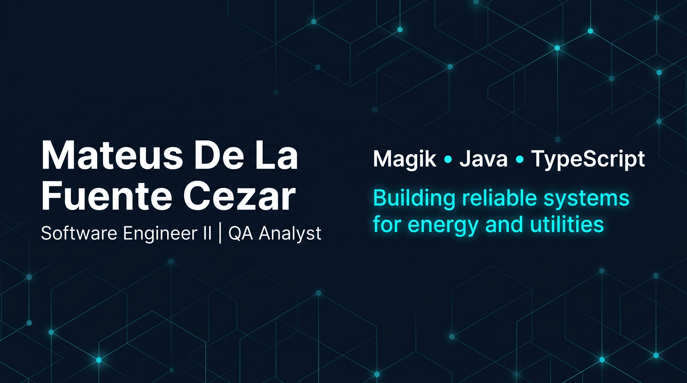

  

<h1 align="center">Mateus De La Fuente Cezar</h1>

  
  
  

  
  
  

  Electrical Engineer with strong software execution in enterprise systems, testing and reliable delivery for the energy and utilities domain.

---

## 🌍 Read in Your Language

  
  
  

> GitHub profile README does not support dynamic language hiding. The best professional UX is one main version plus dedicated language pages.

---

## 🚀 Professional Snapshot

- Software Engineer II / QA Analyst at Minsait (Indra)
- 200+ business demands validated and homologated with test notebooks
- Core stack: Magik, Java, TypeScript
- Broad stack: backend, QA, automation, frontend and data tools
- CREA-PB: 348376-2

### Impact at a Glance

| Area | Evidence |
|---|---|
| Enterprise Delivery | Continuous work in energy and utilities systems |
| QA & Reliability | 200+ homologated/tested demands |
| Engineering Breadth | 49 public repositories with varied technologies |
| Open Source | Active contribution to Magik ecosystem |

---

## 🧩 Featured Work

| Project | Problem Solved | Stack | Links |
|---|---|---|---|
| EnergyCalc | Supports photovoltaic calculations for practical use cases | TypeScript, Web | [Live](https://energy-calc-web.vercel.app/) |
| Entrelinhas Web Game | Interactive language/game experience for end users | JavaScript, Web | [Live](https://entrelinhas-web-game.vercel.app/) |
| Book2Game | Book-driven game platform currently evolving | TypeScript, Product Dev | [Repository](https://github.com/Mateus2314/book2game) |
| Magik Smallworld the Algorithms | Learning resources and algorithms for Magik community | Magik, OOP | [Repository](https://github.com/Mateus2314/Magik_Smallworld_the_Algorithms) |

---

## ⚙️ Core Technologies

  
  
  

  
  
  
  
  

---

## 📈 GitHub Analytics

  
  

  Alternativa ao GitHub Analytics para estatísticas de perfil e linguagem. Se a imagem não carregar, recarregue a página.

---

## 🎧 Coding Soundtrack

  

<a href="#top">Back to top</a>

